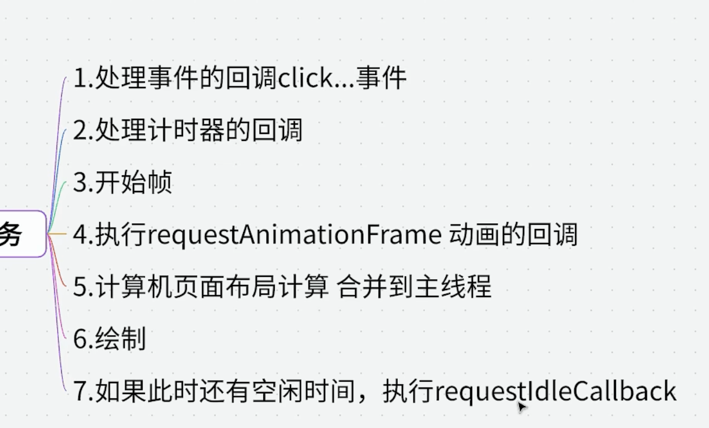
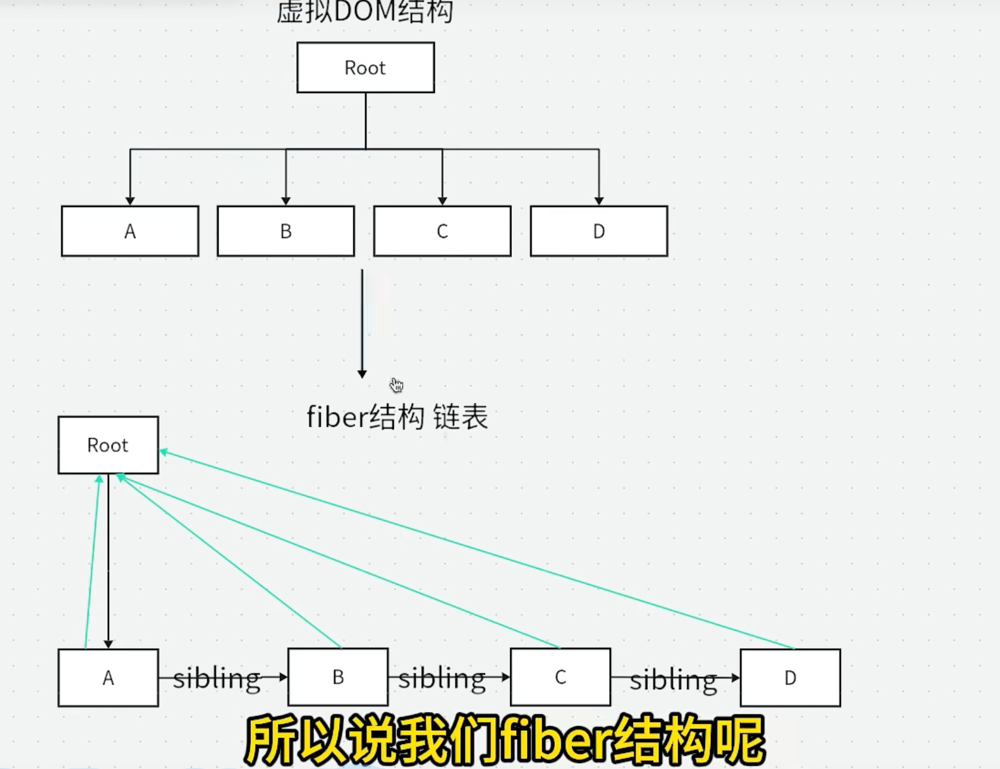

#### 时间切片

##### 浏览器每一帧执行任务

requestIdleCallback 浏览器空闲时执行任务

#### 流程

jsx => 虚拟 dom => 真实 dom
babel 编译 jsx => React.createElement 虚拟 dom

时间切片
利用 requestIdleCallback 浏览器空闲时执行任务

##### fiber 实现目标

可中断的渲染：Fiber 允许将大的渲染任务拆分成多个小的工作单元（Unit of Work），使得 React 可以在空闲时间执行这些小任务。当浏览器需要处理更高优先级的任务时（如用户输入、动画），可以暂停渲染，先处理这些任务，然后再恢复未完成的渲染工作。

优先级调度：在 Fiber 架构下，React 可以根据不同任务的优先级决定何时更新哪些部分。React 会优先更新用户可感知的部分（如动画、用户输入），而低优先级的任务（如数据加载后的界面更新）可以延后执行。

双缓存树（Fiber Tree）：Fiber 架构中有两棵 Fiber 树——current fiber tree（当前正在渲染的 Fiber 树）和 work in progress fiber tree（正在处理的 Fiber 树）。React 使用这两棵树来保存更新前后的状态，从而更高效地进行比较和更新。

任务切片：在浏览器的空闲时间内（利用 requestIdleCallback 思想），React 可以将渲染任务拆分成多个小片段，逐步完成 Fiber 树的构建，避免一次性完成所有渲染任务导致的阻塞。

##### React fiber 链式结构

##### 相关面试题

1.React 虚拟 dom 是什么
描述 UI 的 JavaScript 对象，是真实 DOM 的轻量映射
（1） 性能优化 直接操作真实 DOM 是比较昂贵的，尤其是当涉及到大量节点更新时。虚拟 DOM 通过减少不必要的 DOM 操作，主要体现在 diff 算法的复用操作，其实也提升不了多少性能。
（2） 跨平台能力 虚拟 DOM 可以在不同平台上运行，如浏览器、移动设备等。这使得 React 可以构建跨平台的应用程序，一次编写，多处运行。

2. "Fiber 是什么？解决了什么问题？"
   首先浏览器每一帧是 16.6ms ，如果在这 16.6ms 内完成渲染，那么用户就会感觉到卡顿。
   Fiber 架构通过将渲染任务拆分成多个小的工作单元（Unit of Work），使得 React 可以在空闲时间执行这些小任务。 requestIdleCallback 的思想 浏览器空闲时执行任务

然后就是双缓存树 react 创建两种缓存树 一种是 current fiber tree（当前正在渲染的 Fiber 树）和 work in progress fiber tree（正在处理的 Fiber 树）。
通过 diff 比较这两棵树的差异，找出需要更新的部分。 进行标记 （PLACEMENT、UPDATE、DELETION）

最后通过 commitWork 提交更新 ，将需要更新的部分应用到真实 DOM 上。（useLayoutEffect）

3.diff 中 key 的作用
没有 key，React 按索引顺序逐一对比，所有节点都被认为是"同一个位置"，强制复用并更新 props；有 key，React 按身份识别，精准判断新增、删除、移动、复用
